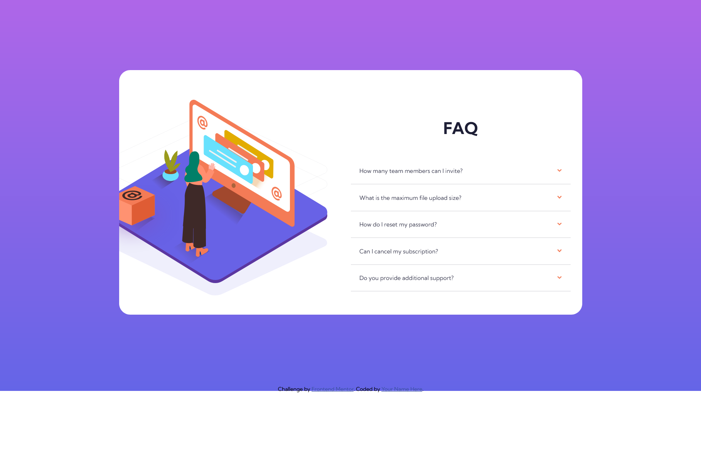
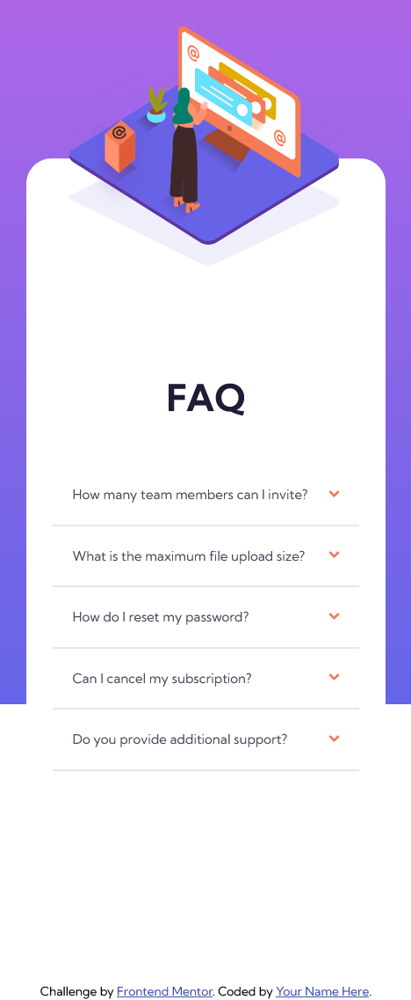

# Frontend Mentor - FAQ accordion card solution

This is a solution to the [FAQ accordion card challenge on Frontend Mentor](https://www.frontendmentor.io/challenges/faq-accordion-card-XlyjD0Oam). Frontend Mentor challenges help you improve your coding skills by building realistic projects. 

## Table of contents

- [Overview](#overview)
  - [The challenge](#the-challenge)
  - [Screenshot](#screenshot)
  - [Links](#links)
- [My process](#my-process)
  - [Built with](#built-with)
  - [What I learned](#what-i-learned)
  - [Continued development](#continued-development)
- [Author](#author)


## Overview

### The challenge

Users should be able to:

- View the optimal layout for the component depending on their device's screen size
- See hover states for all interactive elements on the page
- Hide/Show the answer to a question when the question is clicked

### Screenshot




### Links

- Solution URL: [Github Repo](https://github.com/dralveol/faq-accordion-card)
- Live Site URL: [Live](https://dralveol.github.io/faq-accordion-card/)

## My process

### Built with

- Semantic HTML5 markup
- Sass
- Flexbox
- Mobile-first workflow

### What I learned
The details summary tags were perfect for the assignment, semantic and useful. The css attribute [open] permitted me not to use JS.

```html
<details>
        <summary>How many team members can I invite? </summary>
        <p>You can invite up to 2 additional users on the Free plan. There is no limit on team members for the Premium plan.</p>
      </details>
      <details>
        <summary>What is the maximum file upload size? </summary>
        <p> No more than 2GB. All files in your account must fit your allotted storage space.</p>
      </details>
      <details>
        <summary>How do I reset my password? </summary>
        <p>Click “Forgot password” from the login page or “Change password” from your profile page.
        A reset link will be emailed to you.</p>
      </details>
      <details>
        <summary>Can I cancel my subscription? </summary>
        <p>Yes! Send us a message and we’ll process your request no questions asked.</p>
      </details>
      <details>
        <summary>Do you provide additional support? </summary>
        <p>Chat and email support is available 24/7. Phone lines are open during normal business hours.</p>
      </details>
```


### Continued development

Couldn't quite figure out a way to make the box (since it is positioned absolute) show with the overflow hidden of its parent   (changing the parent on html would have been a solution)

## Author

- Frontend Mentor - [@dralveol](https://www.frontendmentor.io/profile/dralveol)
